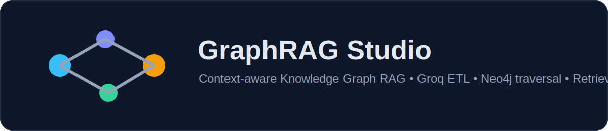
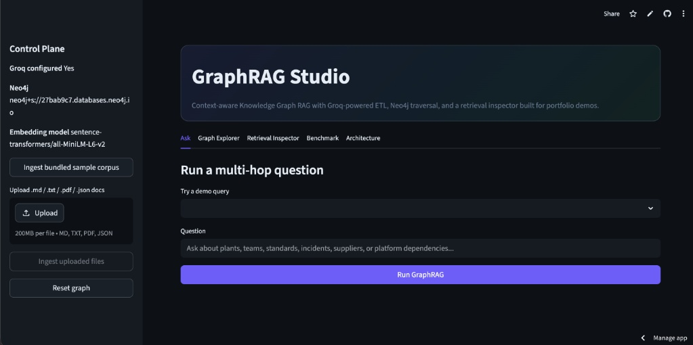
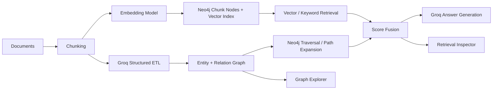

# GraphRAG Studio

<p align="center">
  <a href="https://multihop-graphrag-9krfknzgd6hpwen3pqgsim.streamlit.app/" target="_blank">
    
  </a>
</p>
<p align="center">
  <a href="https://multihop-graphrag-9krfknzgd6hpwen3pqgsim.streamlit.app/">
    
  </a>
</p>
<p align="center">
<i>👆 Click the Live Demo badge above to try the interactive tool directly in your browser.</i></p>

---

<h3 align="center">Context-Aware Knowledge Graph RAG (GraphRAG)</h3>
<p align="center"><b>Experience hybrid retrieval and multi-hop reasoning in action. No installation required.</b></p>

**GraphRAG Studio** is a portfolio-ready implementation of **Context-Aware Knowledge Graph RAG (GraphRAG)** built to showcase hybrid retrieval, multi-hop reasoning, and LLM-driven graph ETL.

## 🎬 Live Demo Preview

<p align="center">
  
</p>

It is designed for exactly the kind of project you would want to put on GitHub after writing a resume bullet like this:

> Designed a hybrid retrieval approach combining vector search with Neo4j traversal for multi-hop reasoning over large document collections. Automated LLM-driven ETL to extract entities/relationships and generate graph-ready schemas. Improved complex query retrieval accuracy over vector-only baselines on a held-out set.

The repo ships with:

- a polished **Streamlit demo UI**
- a reusable **Python package** with ingestion, retrieval, and benchmarking modules
- a **Neo4j-backed graph + vector index** design
- **Groq-powered structured extraction** for graph ETL
- a **benchmark harness** that compares hybrid retrieval vs vector-only retrieval
- docs for architecture, deployment, demo flow, and showcase positioning

## Core idea

1. Ingest documents.
2. Chunk them and embed them.
3. Use Groq structured outputs to extract entities and relationships.
4. Store chunks, entities, and relations in Neo4j.
5. Retrieve with a **hybrid strategy**:
   - vector search for semantic recall
   - keyword search for sparse exact matches
   - graph expansion for multi-hop evidence
6. Fuse scores and generate an answer with citations.

## Architecture



More detail lives in [`docs/architecture.md`](docs/architecture.md) and [`docs/retrieval-design.md`](docs/retrieval-design.md).

## Demo features

### 1. Ask tab
Ask a multi-hop question like:

- Which plants are affected if Orion Gateway firmware issue KB-214 impacts cameras used for weld quality?
- Which team should coordinate with compliance if Atlas Plant pauses WeldVision inspections?
- How does Mercury Data Lake feed Helios Platform analytics for weld defects?

### 2. Graph Explorer
Inspect the entity neighborhood around systems, teams, plants, incidents, or standards.

### 3. Retrieval Inspector
See why each chunk ranked where it did:

- vector contribution
- keyword contribution
- graph support contribution
- final fused score

### 4. Benchmark tab
Compare **vector-only retrieval** against the **hybrid GraphRAG retriever** on a bundled held-out query set.

## Repo structure

```text
.
├── assets/
├── data/
│   ├── benchmark/
│   └── sample_corpus/
├── docs/
├── graphrag_studio/
├── scripts/
├── tests/
├── streamlit_app.py
├── pyproject.toml
├── docker-compose.yml
└── README.md
```

## Quickstart

### 1. Start Neo4j

You can use local Neo4j or AuraDB. For local development:

```bash
docker compose up neo4j -d
```

### 2. Configure environment

```bash
cp .env.example .env
```

Set at least:

```bash
GROQ_API_KEY=your_key_here
NEO4J_URI=bolt://localhost:7687
NEO4J_USERNAME=neo4j
NEO4J_PASSWORD=password12345
```

### 3. Install

```bash
pip install -e ".[dev]"
```

### 4. Load the bundled sample corpus

```bash
python scripts/ingest_sample_corpus.py
```

### 5. Launch the demo UI

```bash
streamlit run streamlit_app.py
```

### 6. Optionally launch the API

```bash
uvicorn graphrag_studio.api:app --reload
```

## Benchmarking

After ingesting the sample corpus:

```bash
python scripts/run_benchmark.py --cases data/benchmark/heldout_queries.json
```

The benchmark compares:

- **vector-only retrieval**
- **hybrid retrieval** = vector + keyword + graph traversal

This lets you show a measurable story rather than a vague architecture claim.

## Adapting this for your real corpus

The bundled documents are fictional demo data. They exist so the project can be cloned, run, and understood immediately.

To adapt it for your real GraphRAG work:

1. replace `data/sample_corpus/` with your documents
2. rerun ingestion
3. replace `data/benchmark/heldout_queries.json` with your held-out evaluation set
4. update the README metrics with your actual measured results

That way the repo stays honest while still looking strong in public.

There is a dedicated positioning note in [`docs/showcase-notes.md`](docs/showcase-notes.md).

## Commands

```bash
make install
make ingest-sample
make run-ui
make run-api
make benchmark
make test
```

## License

MIT
